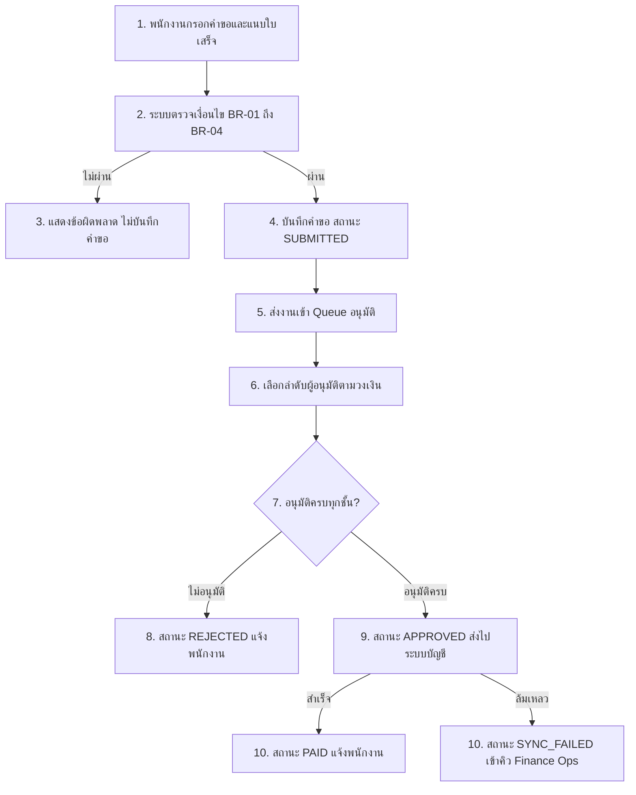
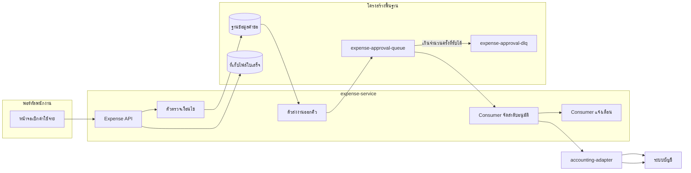
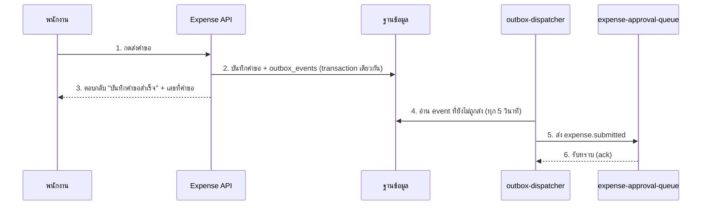
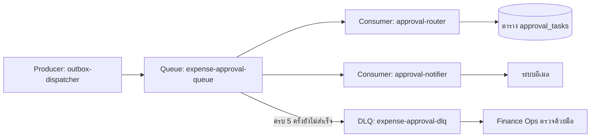
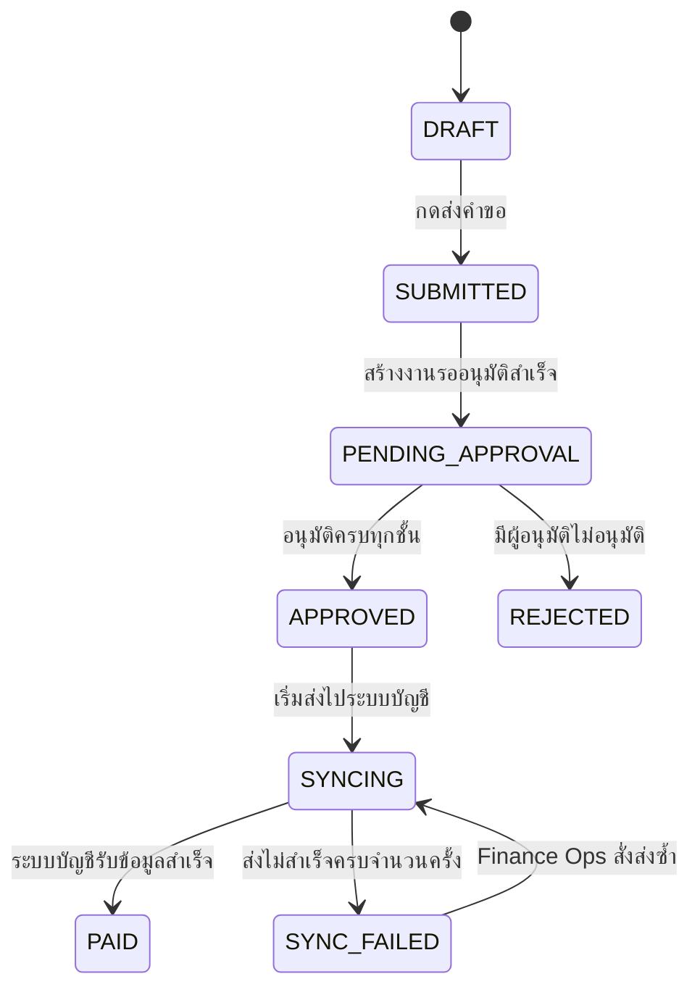

# การยื่นคำขอเบิกค่าใช้จ่าย (Expense Reimbursement)

> **เอกสารนี้** · Feature: Expense Reimbursement · เจ้าของ: ทีม Finance Ops
> · ระดับ: **full** · อัปเดตล่าสุด: 2026-09-17
> · อ้างอิง code: `expense-service@a1b2c3d`, `expense-web@9f8e7d6`, `accounting-adapter@22b1f90`
> · Ticket/PR: EXP-1420 / #318
> · เอกสารนี้เป็น **ตัวอย่างสมมติ** สำหรับเทียบระดับความลึกเท่านั้น

## สรุปสั้น ๆ

พนักงานยื่นคำขอเบิกค่าใช้จ่ายผ่านพอร์ทัล ระบบตรวจวงเงิน วันที่ และการแนบใบเสร็จทันที
ถ้าผ่านจะบันทึกคำขอแล้วส่งงานเข้าคิวอนุมัติแบบเบื้องหลัง ระบบสร้างลำดับผู้อนุมัติตามวงเงิน
(หัวหน้างาน 1 ระดับ หรือ 2 ระดับเมื่อเกิน 50,000 บาท) เมื่ออนุมัติครบจึงส่งข้อมูลไป
ระบบบัญชีและปรับสถานะเป็น `PAID` (จ่ายแล้ว)

พนักงานเห็นผลทันทีแค่ _"บันทึกคำขอสำเร็จ"_ ส่วนการอนุมัติและการจ่ายเป็นงานเบื้องหลัง
ที่ติดตามผ่านอีเมลและหน้าประวัติคำขอ

## 1. ภาพรวม

Feature นี้รับผิดชอบตั้งแต่พนักงานกรอกคำขอจนข้อมูลถูกส่งไปตั้งหนี้ในระบบบัญชี
แบ่งงานเป็น 2 ช่วงชัดเจน:

| ช่วง               | ลักษณะ                                | สิ่งที่ผู้ใช้เห็น           |
| ------------------ | ------------------------------------- | --------------------------- |
| ตรวจและบันทึกคำขอ  | ทำงานทันทีตอนกดส่ง (synchronous)      | ผลตรวจบนหน้าจอ + เลขที่คำขอ |
| อนุมัติและส่งบัญชี | ทำงานเบื้องหลังผ่านคิว (asynchronous) | อีเมล + สถานะในหน้าประวัติ  |

ประเด็นที่คนอ่านต้องเข้าใจตรงกัน: **บันทึกสำเร็จ ≠ อนุมัติแล้ว ≠ จ่ายแล้ว**
สามเหตุการณ์นี้ห่างกันได้เป็นวัน และผู้ใช้ต้องรู้ว่ากำลังดูสถานะไหนอยู่

## 2. จุดประสงค์ทาง Business

- ตัดขั้นตอนส่งเอกสารกระดาษไป Finance Ops (`/expenses/new` แทนแบบฟอร์มเดิม)
- บังคับใช้วงเงินและเงื่อนไขอนุมัติเป็นมาตรฐานเดียวทุกฝ่าย แทนการตกลงกันปากเปล่า
- ให้ Finance Ops ตรวจย้อนหลังได้ว่าคำขอใดอนุมัติโดยใคร เมื่อไร และส่งบัญชีเมื่อไร
- ลดรายการค้างที่ไม่มีใครรู้ว่าไปถึงขั้นตอนไหน

ตัวชี้วัดที่ระบบรองรับให้วัดได้: จำนวนคำขอที่ค้างเกิน 3 วันในสถานะ `PENDING_APPROVAL`
และจำนวนรายการที่ตกไป `SYNC_FAILED` (นับจาก `expense.sync_failed` event)

## 3. ผู้ที่เกี่ยวข้อง

| บทบาท                       | หน้าที่ในระบบ                        | เข้าถึงผ่าน                              |
| --------------------------- | ------------------------------------ | ---------------------------------------- |
| พนักงาน                     | สร้าง ยื่น และติดตามคำขอของตัวเอง    | พอร์ทัลพนักงาน → เมนู "เบิกค่าใช้จ่าย"   |
| หัวหน้างาน (Approver L1)    | อนุมัติ/ไม่อนุมัติรายการของลูกทีม    | กล่องงานรออนุมัติ + ลิงก์ในอีเมล         |
| ผู้จัดการฝ่าย (Approver L2) | อนุมัติรายการที่เกินวงเงิน           | กล่องงานรออนุมัติ                        |
| Finance Ops                 | ตรวจและแก้รายการที่ส่งบัญชีไม่สำเร็จ | หน้าจอ Operations → รายการ `SYNC_FAILED` |
| ระบบบัญชี (Accounting)      | รับข้อมูลเพื่อตั้งหนี้จ่าย           | API รับข้อมูลจาก `accounting-adapter`    |

## 4. หน้าจอที่เกี่ยวข้อง

จุดที่ต้องมีภาพจริงประกอบ (แคปจากระบบจริงเท่านั้น ห้ามใช้ภาพสร้าง):

| จุด                 | สิ่งที่ต้องเห็นในภาพ                 |
| ------------------- | ------------------------------------ |
| ฟอร์มยื่นคำขอ       | ช่องกรอก เลขที่คำขอ และปุ่มส่ง       |
| หน้าจอผลตรวจไม่ผ่าน | ข้อความบอกว่ารายการใดไม่ผ่านเงื่อนไข |
| กล่องงานรออนุมัติ   | รายการที่รออนุมัติพร้อมวงเงิน        |
| หน้าประวัติคำขอ     | สถานะล่าสุดและไทม์ไลน์การอนุมัติ     |

ตัวอย่าง caption ที่ต้องมีใต้ภาพ:

```text
ภาพที่ 1 — ฟอร์มยื่นคำขอเบิกค่าใช้จ่าย (แคปจาก UAT 2026-09-15)
ผู้อ่านต้องสังเกต: ปุ่ม "ส่งคำขอ" จะกดได้หลังแนบใบเสร็จครบทุกบรรทัด
หมายเหตุ: ใช้ข้อมูลทดสอบ ไม่มีข้อมูลพนักงานจริง
```

> ในเอกสารตัวอย่างนี้ยังไม่มีไฟล์ภาพจริง — งานจริงต้องแคปจากระบบหรือผู้ใช้แนบให้
> ถ้าแคปไม่ได้ให้ระบุ `TBD / ไม่สามารถ capture UI จริงได้จาก environment นี้`

## 5. ขั้นตอนการทำงานของผู้ใช้

1. พนักงานเปิดเมนู "เบิกค่าใช้จ่าย" และกรอกจำนวนเงิน หมวด และวันที่ในใบเสร็จ
2. แนบไฟล์ใบเสร็จ (บังคับ ยกเว้นหมวดค่าเดินทางประจำที่ไม่เกิน 500 บาท)
3. กด **ส่งคำขอ** → ระบบตรวจเงื่อนไขทันที (BR-01 ถึง BR-04)
4. ถ้าไม่ผ่าน ระบบแสดงข้อผิดพลาดรายบรรทัดและยังไม่บันทึกคำขอ
5. ถ้าผ่าน ระบบบันทึกคำขอสถานะ `SUBMITTED` และแสดงเลขที่คำขอ
6. ระบบส่งงานเข้าคิวอนุมัติเบื้องหลัง → สถานะเปลี่ยนเป็น `PENDING_APPROVAL`
7. หัวหน้างานได้รับอีเมลและอนุมัติในกล่องงานของตัวเอง
8. อนุมัติครบทุกชั้น → ระบบส่งข้อมูลไประบบบัญชีและแจ้งพนักงานทางอีเมล

## 6. Business Flow



> อ่านภาพ: สี่เหลี่ยมที่ 1–3 คือช่วงที่ผู้ใช้รออยู่หน้าจอ ส่วน 5 เป็นต้นไปเป็นงานเบื้องหลัง
> ทั้งหมด ผู้ใช้ปิดหน้าจอได้เลยโดยงานไม่หาย เพราะคำขอถูกบันทึกก่อนส่งเข้าคิวแล้ว

## 7. กฎของระบบ

| Rule  | เงื่อนไข           | ค่าที่ใช้จริง                                                 | ที่มา                                          |
| ----- | ------------------ | ------------------------------------------------------------- | ---------------------------------------------- |
| BR-01 | วงเงินต่อรายการ    | ไม่เกิน 50,000 บาท ต่อรายการ เกินกว่านี้ต้องอนุมัติ L2        | `expense-service/src/domain/expense.rules.ts`  |
| BR-02 | การแนบใบเสร็จ      | บังคับทุกหมวด ยกเว้น `TRAVEL_ROUTINE` ที่ไม่เกิน 500 บาท      | `expense.rules.ts`, enum `ExpenseCategory`     |
| BR-03 | อายุใบเสร็จ        | ยื่นได้ไม่เกิน 90 วันนับจากวันที่บนใบเสร็จ                    | `expense.rules.ts`                             |
| BR-04 | ผู้มีสิทธิ์อนุมัติ | ผู้อนุมัติต้องไม่ใช่ผู้ยื่นรายการนั้นเอง                      | `expense-service/src/domain/approval-chain.ts` |
| BR-05 | ลำดับอนุมัติ       | ≤ 50,000 บาท ใช้ L1 ชั้นเดียว, > 50,000 บาท ใช้ L1 แล้วต่อ L2 | `approval-chain.ts`                            |
| BR-06 | การแก้คำขอ         | แก้ได้เฉพาะสถานะ `DRAFT` และ `SUBMITTED` เท่านั้น             | `expense-status.enum.ts`                       |
| BR-07 | การส่งข้อมูลซ้ำ    | ระบบต้องไม่ตั้งหนี้ซ้ำ ใช้คู่ `expenseId + eventId` เป็นกุญแจ | `accounting-adapter/src/idempotency.ts`        |

## 8. ภาพรวมระบบ



> อ่านภาพ: `expense-service` เป็นเจ้าของงานทั้งช่วงตรวจและช่วงอนุมัติ ส่วน
> `accounting-adapter` เป็นด่านเดียวที่คุยกับระบบบัญชี ทำให้เปลี่ยนระบบบัญชีในอนาคต
> ไม่ต้องแก้ฝั่งคำขอเบิก

## 9. การทำงานเบื้องหลัง

| งาน                   | ทำงานเมื่อไร                      | ทำอะไร                                                 |
| --------------------- | --------------------------------- | ------------------------------------------------------ |
| `outbox-dispatcher`   | ทุก 5 วินาที                      | อ่านตาราง `outbox_events` แล้วส่ง event ที่ค้างขึ้นคิว |
| `approval-router`     | เมื่อมี event `expense.submitted` | สร้างลำดับผู้อนุมัติและงานรออนุมัติ                    |
| `approval-notifier`   | เมื่อเกิด `approval.task.created` | ส่งอีเมลแจ้งผู้อนุมัติ                                 |
| `accounting-sync`     | เมื่ออนุมัติครบทุกชั้น            | ส่งข้อมูลไป `accounting-adapter` และปรับสถานะ          |
| `stale-approval-scan` | ทุกวัน 08:00                      | หาคำขอค้างเกิน 3 วัน แล้วแจ้งเตือนซ้ำ                  |

## 10. จังหวะส่งงานเข้า Queue

ระบบไม่ส่งงานเข้าคิวตอนที่ยังไม่ commit ข้อมูล ใช้ **outbox pattern**:
บันทึกคำขอและบันทึก event ลงตาราง `outbox_events` ใน transaction เดียวกัน
จากนั้น `outbox-dispatcher` ค่อยอ่านและส่งขึ้นคิวทุก 5 วินาที



> อ่านภาพ: ผู้ใช้ได้คำตอบที่ข้อ 3 ก่อนที่งานจะเข้า Queue ที่ข้อ 5 ด้วยซ้ำ
> ดังนั้น "ส่งสำเร็จ" ในหน้าจอไม่เคยหมายถึง "เข้าระบบอนุมัติแล้ว"

จุดที่ต้องระวัง: ถ้า `outbox-dispatcher` ล่ม งานจะยังค้างอยู่ในตาราง
ไม่หายและไม่ต้องให้พนักงานยื่นใหม่ — ระบบจะส่งต่อเมื่อตัวส่งกลับมาทำงาน

## 11. Queue / Consumer Flow



| Event                   | ผู้ส่ง              | ผู้รับ              | ผลลัพธ์                             |
| ----------------------- | ------------------- | ------------------- | ----------------------------------- |
| `expense.submitted`     | `outbox-dispatcher` | `approval-router`   | สร้างงานรออนุมัติตามลำดับที่ถูกต้อง |
| `approval.task.created` | `approval-router`   | `approval-notifier` | ส่งอีเมลถึงผู้อนุมัติ               |
| `expense.approved`      | `approval-router`   | `accounting-sync`   | เริ่มส่งข้อมูลไประบบบัญชี           |
| `expense.sync_failed`   | `accounting-sync`   | หน้าจอ Operations   | แจ้ง Finance Ops เข้าตรวจ           |

## 12. สถานะของงาน



| สถานะ              | ความหมายทางธุรกิจ            | ใครเห็น              | ขั้นต่อไปใครทำ     |
| ------------------ | ---------------------------- | -------------------- | ------------------ |
| `DRAFT`            | ยังไม่ยื่น แก้ไขได้          | พนักงาน              | พนักงานกดส่ง       |
| `SUBMITTED`        | ยื่นแล้ว รอสร้างงานอนุมัติ   | พนักงาน              | ระบบ               |
| `PENDING_APPROVAL` | รอผู้อนุมัติตัดสิน           | พนักงาน + ผู้อนุมัติ | ผู้อนุมัติ         |
| `APPROVED`         | อนุมัติครบ รอส่งบัญชี        | พนักงาน              | ระบบ               |
| `SYNCING`          | กำลังส่งข้อมูลไประบบบัญชี    | พนักงาน              | ระบบ               |
| `PAID`             | ระบบบัญชีรับแล้ว ถือว่าจบ    | พนักงาน              | —                  |
| `REJECTED`         | มีผู้อนุมัติไม่อนุมัติ       | พนักงาน              | พนักงานยื่นใหม่ได้ |
| `SYNC_FAILED`      | ส่งบัญชีไม่สำเร็จ ต้องมีคนดู | Finance Ops          | Finance Ops        |

> ชื่อในวงเล็บคือค่าที่ระบบเก็บจริงในฐานข้อมูล ใช้ค้นใน log ได้ตรง ๆ
> ส่วนคำอธิบายภาษาไทยคือความหมายที่คน Business ใช้คุยกัน

## 13. กรณีผิดปกติ

| กรณี                      | ระบบทำอะไร                                          | ผลกับผู้ใช้                    |
| ------------------------- | --------------------------------------------------- | ------------------------------ |
| ตรวจเงื่อนไขไม่ผ่าน       | ไม่บันทึกคำขอ แสดงข้อผิดพลาดรายบรรทัด               | ต้องแก้แล้วยื่นใหม่            |
| ส่งงานเข้าคิวไม่สำเร็จ    | คง event ใน `outbox_events` แล้วลองใหม่ทุก 5 วินาที | ไม่ต้องทำอะไร ระบบตามให้       |
| Consumer ล้มเหลวชั่วคราว  | ลองใหม่ 3 ครั้ง (เว้น 2, 8, 30 วินาที)              | ยังไม่เห็นสถานะเปลี่ยน         |
| ล้มเหลวครบ 5 ครั้ง        | ย้ายเข้า `expense-approval-dlq` และแจ้ง Finance Ops | อีเมลแจ้งว่าอยู่ระหว่างตรวจสอบ |
| ส่งระบบบัญชีไม่สำเร็จ     | สถานะ `SYNC_FAILED` และแจ้ง Finance Ops             | รอ Finance Ops ส่งซ้ำ          |
| ส่งข้อมูลซ้ำ              | ด่าน idempotency ที่ `accounting-adapter` ตัดทิ้ง   | ไม่มีผล ไม่ตั้งหนี้ซ้ำ         |
| คำขอค้างอนุมัติเกิน 3 วัน | `stale-approval-scan` แจ้งเตือนผู้อนุมัติซ้ำ        | ผู้อนุมัติได้อีเมลเตือน        |

## 14. Integration / External API

| ระบบปลายทาง      | ทิศทาง  | รายละเอียด                                                               |
| ---------------- | ------- | ------------------------------------------------------------------------ |
| ระบบบัญชี        | ส่งออก  | `POST https://api.example.com/journal-entries` ผ่าน `accounting-adapter` |
| ระบบอีเมล        | ส่งออก  | แจ้งผู้อนุมัติและแจ้งผลให้พนักงาน                                        |
| ระบบพนักงาน (HR) | รับเข้า | ดึงข้อมูลหัวหน้างานมาใช้สร้างลำดับอนุมัติ                                |

> URL ในเอกสารใช้โดเมนตัวอย่างเสมอ ห้ามใส่ hostname จริงขององค์กร

## 15. ข้อมูลที่จัดเก็บ / ส่งต่อ

| ข้อมูล           | เก็บที่                | ส่งต่อที่ไหน | หมายเหตุ                        |
| ---------------- | ---------------------- | ------------ | ------------------------------- |
| คำขอเบิก         | ตาราง `expenses`       | ระบบบัญชี    | ไม่เก็บเลขบัญชีธนาคารในตารางนี้ |
| รายการย่อย       | ตาราง `expense_items`  | ระบบบัญชี    | หนึ่งคำขอมีได้หลายบรรทัด        |
| ไฟล์ใบเสร็จ      | S3 (bucket ภายใน)      | ไม่ส่งต่อ    | เก็บ 5 ปีตามนโยบาย              |
| ประวัติอนุมัติ   | ตาราง `approval_tasks` | ไม่ส่งต่อ    | ใช้ตรวจย้อนหลัง                 |
| Event ที่ค้างส่ง | ตาราง `outbox_events`  | คิวอนุมัติ   | ลบหลังส่งสำเร็จ                 |

## 16. ผลลัพธ์ที่ผู้ใช้ได้รับ

| จังหวะ             | พนักงานเห็น                               | เวลาที่คาดหวัง          |
| ------------------ | ----------------------------------------- | ----------------------- |
| กดส่ง              | ข้อความยืนยัน + เลขที่คำขอ                | ทันที                   |
| เข้าสู่ระบบอนุมัติ | อีเมลแจ้งผู้อนุมัติ                       | ภายใน ~5 วินาที         |
| อนุมัติครบ         | สถานะเปลี่ยนเป็น `APPROVED` ในหน้าประวัติ | ตามเวลาผู้อนุมัติ       |
| ส่งบัญชีสำเร็จ     | สถานะ `PAID` + อีเมลแจ้งปิดงาน            | โดยปกติภายใน 1 วันทำการ |
| ผิดพลาด            | อีเมลแจ้งว่าอยู่ระหว่างตรวจสอบ            | เมื่อเกิดเหตุ           |

## 17. คำศัพท์ที่ใช้ในเอกสาร

| คำในเอกสาร   | ความหมาย                                 | ค่าในระบบ          |
| ------------ | ---------------------------------------- | ------------------ |
| คำขอเบิก     | หนึ่งครั้งที่พนักงานยื่นเรื่องขอเงินคืน  | `expenses`         |
| งานรออนุมัติ | รายการที่รอผู้อนุมัติตัดสินหนึ่งชั้น     | `approval_tasks`   |
| วงเงิน       | เพดานเงินต่อรายการที่อนุมัติได้ชั้นเดียว | 50,000 บาท         |
| ส่งบัญชี     | การส่งข้อมูลไปตั้งหนี้ในระบบบัญชี        | `SYNCING` → `PAID` |

คำที่ควรใช้ตรงกันทั้งระบบอยู่ใน `docs/glossary.md` — ถ้าเอกสารนี้อ้างคำใหม่
ให้เพิ่มเข้าไฟล์กลางนั้นด้วย

## Technical Reference

| ประเภท            | Reference                                                                                        |
| ----------------- | ------------------------------------------------------------------------------------------------ |
| Entry point (UI)  | `expense-web/src/pages/expenses/new.tsx`                                                         |
| Entry point (API) | `POST /api/expenses`, `expense-service/src/api/expense.controller.ts`                            |
| Business rules    | `expense-service/src/domain/expense.rules.ts`                                                    |
| Approval chain    | `expense-service/src/domain/approval-chain.ts`                                                   |
| Status enum       | `expense-service/src/domain/expense-status.enum.ts`                                              |
| Producer          | `expense-service/src/infra/outbox-dispatcher.ts` (`expense.submitted`)                           |
| Queue / DLQ       | SQS `expense-approval-queue`, `expense-approval-dlq` (`infra/queue.tf`)                          |
| Retry policy      | 3 ครั้ง, backoff 2/8/30 วินาที, `maxReceiveCount` 5 (`infra/queue.tf`)                           |
| Consumers         | `consumers/approval-router.ts`, `consumers/approval-notifier.ts`, `consumers/accounting-sync.ts` |
| Scheduler         | `jobs/stale-approval-scan.ts` (ทุกวัน 08:00)                                                     |
| External adapter  | `accounting-adapter/src/idempotency.ts`, `POST /journal-entries`                                 |
| Storage           | ตาราง `expenses`, `expense_items`, `approval_tasks`, `outbox_events`; S3 สำหรับใบเสร็จ           |

## ประวัติการแก้ไข

| วันที่     | เปลี่ยนอะไร                                             | อ้างอิง         |
| ---------- | ------------------------------------------------------- | --------------- |
| 2026-09-17 | สร้างเอกสารครั้งแรก ครอบคลุม flow อนุมัติและ sync บัญชี | EXP-1420 / #318 |
