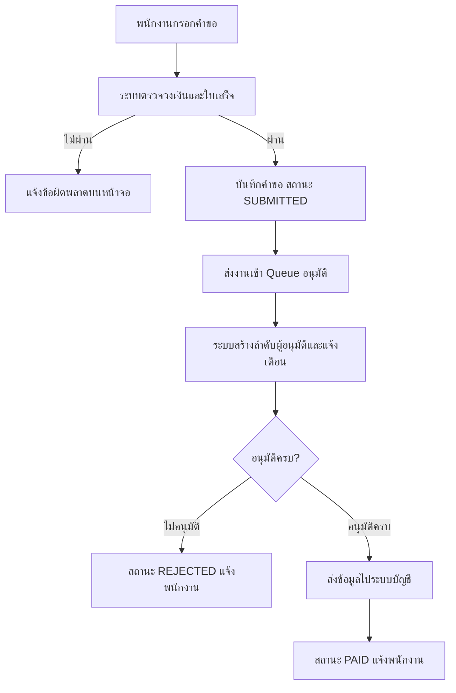

# การยื่นคำขอเบิกค่าใช้จ่าย (Expense Reimbursement)

> **เอกสารนี้** · Feature: Expense Reimbursement · เจ้าของ: ทีม Finance Ops
> · ระดับ: **lite** · อัปเดตล่าสุด: 2026-09-17
> · อ้างอิง code: `expense-service@a1b2c3d`, `expense-web@9f8e7d6`
> · Ticket/PR: EXP-1420 / #318
> · เอกสารนี้เป็น **ตัวอย่างสมมติ** สำหรับเทียบระดับความลึกเท่านั้น

## สรุปสั้น ๆ

พนักงานยื่นคำขอเบิกค่าใช้จ่ายผ่านหน้าจอในพอร์ทัล ระบบตรวจวงเงินและเงื่อนไขการแนบใบเสร็จ
แล้วส่งงานเข้าระบบอนุมัติตามลำดับหัวหน้างาน เมื่ออนุมัติครบระบบส่งข้อมูลไประบบบัญชี
และปรับสถานะเป็น `PAID` (จ่ายแล้ว) พนักงานติดตามสถานะได้จากประวัติคำขอของตัวเอง

## 1. ภาพรวม

ระบบรับคำขอเบิกจากพนักงาน แยกเป็น 2 ช่วงงาน:

1. **ช่วงตรวจและบันทึก** — ทำทันทีตอนพนักงานกดส่ง พนักงานเห็นผลบนจอ
2. **ช่วงอนุมัติและส่งบัญชี** — ทำงานเบื้องหลังแบบ async พนักงานเห็นผลผ่านการแจ้งเตือน
   และสถานะในหน้าประวัติ

จุดที่ต้องเข้าใจให้ตรงกัน: **การกดส่งสำเร็จ ≠ อนุมัติแล้ว ≠ จ่ายแล้ว**
สามเหตุการณ์นี้เกิดต่างเวลากัน

## 2. จุดประสงค์ทาง Business

- ตัดขั้นตอนส่งเอกสารกระดาษไป Finance Ops
- บังคับใช้วงเงินและเงื่อนไขอนุมัติเป็นมาตรฐานเดียวกันทุกฝ่าย (`expense.rules.ts`)
- ให้ Finance Ops ตรวจย้อนหลังได้ว่าคำขอใดอนุมัติโดยใคร เมื่อไร

## 3. ผู้ที่เกี่ยวข้อง

| บทบาท                       | หน้าที่ในระบบ                        |
| --------------------------- | ------------------------------------ |
| พนักงาน                     | ยื่นคำขอ ติดตามสถานะ                 |
| หัวหน้างาน (Approver L1)    | อนุมัติรายการวงเงินปกติ              |
| ผู้จัดการฝ่าย (Approver L2) | อนุมัติรายการเกินวงเงินที่กำหนด      |
| Finance Ops                 | ตรวจรายการที่ระบบส่งไปบัญชีไม่สำเร็จ |
| ระบบบัญชี (Accounting)      | รับข้อมูลเพื่อตั้งหนี้จ่าย           |

## 4. Business Flow

> สังเกต: เส้นทางหลักหลังกดส่งทั้งหมดเป็นงานเบื้องหลัง หน้าจอของพนักงานจบที่
> "บันทึกคำขอ สำเร็จ" เท่านั้น

## 5. กฎของระบบ

| Rule  | รายละเอียด                                                                        |
| ----- | --------------------------------------------------------------------------------- |
| BR-01 | วงเงินต่อรายการไม่เกิน 50,000 บาท ถ้าเกินต้องอนุมัติระดับ L2 (`expense.rules.ts`) |
| BR-02 | ต้องแนบใบเสร็จทุกรายการ ยกเว้นหมวดค่าเดินทางประจำที่ไม่เกิน 500 บาท               |
| BR-03 | ยื่นได้ไม่เกิน 90 วันนับจากวันที่ในใบเสร็จ                                        |
| BR-04 | ผู้ยื่นต้องไม่ใช่ผู้อนุมัติรายการของตัวเอง                                        |

## 6. จังหวะส่งงานเข้า Queue

งานเข้า Queue **หลัง** บันทึกคำขอลงฐานข้อมูลสำเร็จแล้ว (ไม่ใช่ก่อน commit)
ระบบใช้ตาราง `outbox_events` แล้วมีตัวส่งงานแยกออกไป (`outbox-dispatcher.ts`)

ผลที่ตามมา: ถ้าตัวส่งงานล่ม คำขอจะยังถูกบันทึกและจะถูกส่งตามภายหลัง
พนักงานไม่ต้องยื่นใหม่

## 7. ผลลัพธ์ที่ผู้ใช้ได้รับ

| จังหวะ             | พนักงานเห็นอะไร                                      |
| ------------------ | ---------------------------------------------------- |
| กดส่ง              | ข้อความยืนยันว่าบันทึกคำขอแล้ว พร้อมเลขที่คำขอ       |
| ส่งเข้าระบบอนุมัติ | อีเมลแจ้งผู้ที่ต้องอนุมัติ                           |
| อนุมัติครบ         | อีเมลแจ้งว่าอนุมัติแล้ว และสถานะเปลี่ยนในหน้าประวัติ |
| ส่งบัญชีสำเร็จ     | สถานะ `PAID` ในหน้าประวัติ                           |

## Technical Reference

| ประเภท      | Reference                                                              |
| ----------- | ---------------------------------------------------------------------- |
| Entry point | `expense-web/src/pages/expenses/new.tsx`                               |
| Validate    | `expense-service/src/domain/expense.rules.ts`                          |
| Producer    | `expense-service/src/infra/outbox-dispatcher.ts` (`expense.submitted`) |
| Queue       | `expense-approval-queue` (SQS)                                         |
| Consumer    | `expense-service/src/consumers/approval-router.ts`                     |
| Status enum | `expense-service/src/domain/expense-status.enum.ts`                    |

## ประวัติการแก้ไข

| วันที่     | เปลี่ยนอะไร         | อ้างอิง         |
| ---------- | ------------------- | --------------- |
| 2026-09-17 | สร้างเอกสารครั้งแรก | EXP-1420 / #318 |
